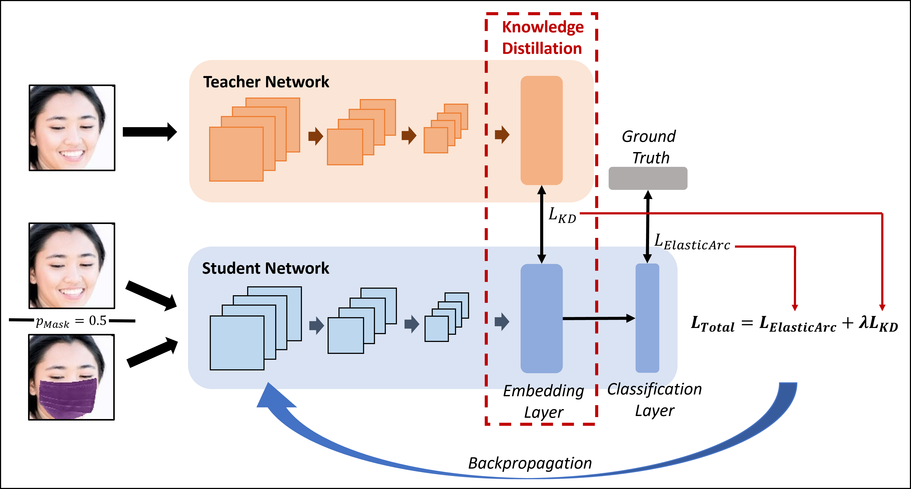

# Mask-invariant Face Recognition through Template-level Knowledge Distillation

This is the official repository of "Mask-invariant Face Recognition through Template-level Knowledge Distillation" accepted at *IEEE International Conference on Automatic Face and Gesture Recognition 2021 (FG2021)*.

 


Research Paper at:

* [Arxiv](https://arxiv.org/abs/2112.05646)

## Table of Contents 

- [Abstract](#abstract)
- [Data](#data)
- [Model Training](#model-training)
- [Citing](#citing)
- [Acknowledgement](#acknowledgement)
- [License](#license)

### Abstract ###

The emergence of the global COVID-19 pandemic poses new challenges for biometrics. Not only are contactless
biometric identification options becoming more important, but face recognition has also recently been confronted with the
frequent wearing of masks. These masks affect the performance of previous face recognition systems, as they hide important identity information. In this paper, we propose a
mask-invariant face recognition solution (MaskInv) that utilizes template-level knowledge distillation within a training paradigm
that aims at producing embeddings of masked faces that are similar to those of non-masked faces of the same identities.
In addition to the distilled knowledge, the student network benefits from additional guidance by margin-based identity
classification loss, ElasticFace, using masked and non-masked faces. In a step-wise ablation study on two real masked
face databases and five mainstream databases with synthetic masks, we prove the rationalization of our MaskInv approach.
Our proposed solution outperforms previous state-of-the-art (SOTA) academic solutions in the recent MFRC-21 challenge
in both scenarios, masked vs masked and masked vs nonmasked, and also outperforms the previous solution on the
MFR2 dataset. Furthermore, we demonstrate that the proposed model can still perform well on unmasked faces with only a
minor loss in verification performance.

## Data ## 

### Datasets ###
The MFR2 dataset can be downloaded [here](https://github.com/aqeelanwar/MaskTheFace).

The preprocessed benchmarks (LFW, CALFW, CPLFW, AgeDB-30, CFP-FP) can be downloaded [here](https://github.com/deepinsight/insightface/tree/master/recognition/_datasets_) as "MS1M-ArcFace (85K ids/5.8M images)". 

The [MFRC-21](https://www.igd.fraunhofer.de/sites/default/files/media/biblio/2021/2021_boutros_mfr_2021.pdf) dataset is not available for the public.

### Masks ###
The mask template used to create the synthetic masked data for training and evaluation is [attached](https://github.com/fdbtrs/Masked-Face-Recognition-KD/blob/main/mask_img.png).
The colors for the synthetic masks on the benchmark can be downloaded [here](https://drive.google.com/drive/folders/1bW48uHfemK21vzy9eOsCuvvg9iT9RbPt?usp=sharing), they have to be placed in the /eval/ directory.

### Model Training ###
 1. Download pretrained ElasitcFace model [ElasticFace-Arc Model](https://github.com/fdbtrs/ElasticFace) and copy it to the output folder
 2. Download MS1MV2 dataset from [insightface](https://github.com/deepinsight/insightface/tree/master/recognition/_datasets_) on strictly follow the licence distribution
 3. Set the config.rec in config/configKD.py to the dataset path
 4. Intall the requirement from requirement.txt: pip install -r requirements.txt
 5. run train_kd.py 
### Pretrained Models ###
All evaluated pre-trained models are available:
* [ArcFace Model](https://github.com/deepinsight/insightface/tree/master/model_zoo)
* [MagFace Model](https://github.com/IrvingMeng/MagFace)
* [ElasticFace-Arc Model](https://github.com/fdbtrs/ElasticFace)


Our models can be downloaded [here](https://drive.google.com/drive/folders/1HMpNlECooNJ3d-on8KGTBEuxUjWnrT1I?usp=sharing).

## Citing ##
If you use any of the code provided in this repository or the models provided, please cite the following paper:
```
@misc{huber2021maskinvariant,
      title={Mask-invariant Face Recognition through Template-level Knowledge Distillation}, 
      author={Marco Huber and Fadi Boutros and Florian Kirchbuchner and Naser Damer},
      year={2021},
      eprint={2112.05646},
      archivePrefix={arXiv},
      primaryClass={cs.CV}
}
```

## Acknowledgement ##
This research work has been funded by the German Federal Ministry of Education and Research and the Hessian Ministry of Higher Education, Research, Science and the Arts within their joint support of the National Research Center for Applied Cybersecurity ATHENE.

## License ##

This project is licensed under the terms of the Attribution-NonCommercial 4.0 International (CC BY-NC 4.0) license.
Copyright (c) 2021 Fraunhofer Institute for Computer Graphics Research IGD Darmstadt
